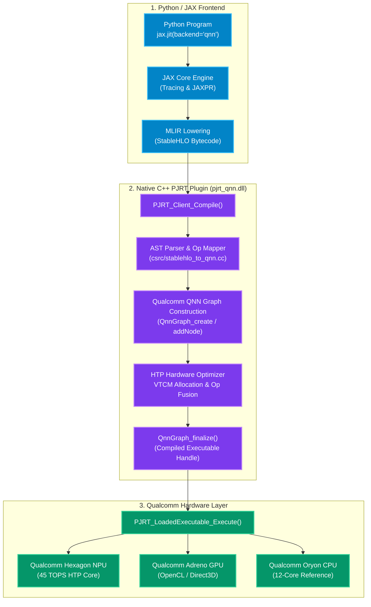
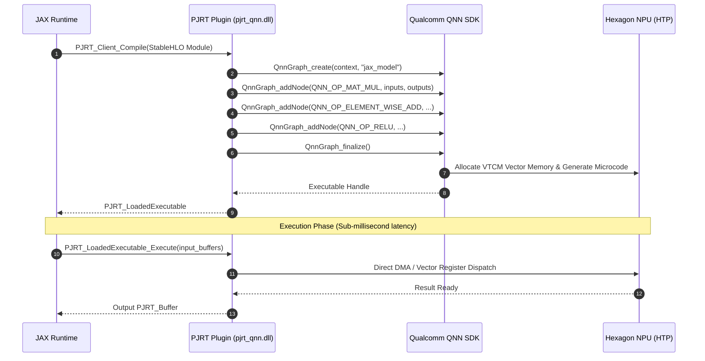

# Accelerating JAX on Qualcomm Snapdragon: Building a Native QNN Backend with OpenXLA PJRT

*By carrycooldude — August 2026*

---

## Introduction

JAX has emerged as the weapon of choice for machine learning researchers and systems engineers thanks to its functional purity, composable transformations (`jit`, `grad`, `vmap`), and first-class compiler pipeline. Historically, however, JAX’s high-performance hardware execution has been constrained primarily to NVIDIA GPUs and Google TPUs, with CPU as a fallback.

With the advent of the **Qualcomm Snapdragon® X Elite (45 TOPS Hexagon NPU)** and Snapdragon mobile SoCs, a massive amount of high-efficiency tensor compute became available on edge and client devices.

In this deep-dive, we explore **JAX-QNN** — an open-source, native backend for JAX that maps **StableHLO** operations directly into Qualcomm execution graphs using OpenXLA's **PJRT C API** standard.

---

## The Core Challenge: Why Not Just Wrap ONNX?

A naive approach to supporting Qualcomm hardware is converting Python tensors to ONNX and invoking ONNX Runtime through Python. While functional for quick prototypes, this introduces several fundamental flaws:

1. **Host-Device Synchronization Bottlenecks**: Round-tripping NumPy arrays through Python wrappers breaks JAX’s asynchronous dispatch model and buffer lifecycle management.
2. **Loss of Transformation Semantics**: JAX functional transforms (`vmap`, `custom_vjp`, `lax.scan`) cannot be natively reasoned about across a static ONNX boundary.
3. **High Memory Overhead**: Python-level runtime orchestration incurs CPU cache thrashing, bypassing on-chip Vector Tightly-Coupled Memory (VTCM).

To achieve true zero-overhead compilation, JAX must interface with Qualcomm hardware at the **compiler runtime layer** via **PJRT (Plugin JIT RunTime)**.

---

## System Architecture

The following Mermaid diagram illustrates the end-to-end compiler lifecycle of a JAX computation targeting Qualcomm hardware:



---

## Inside the Compiler: Mapping StableHLO to QNN

When `@jax.jit(..., backend="qnn")` is invoked, JAX compiles the traced JAXPR into **StableHLO** (Stable High-Level Optimizer dialect in MLIR). 

For example, a dense layer `jax.nn.relu(jnp.matmul(x, w) + b)` emits:

```mlir
func.func @main(%arg0: tensor<128x512xf32>, %arg1: tensor<512x512xf32>, %arg2: tensor<512xf32>) -> tensor<128x512xf32> {
  %0 = "stablehlo.dot_general"(%arg0, %arg1) {
    dot_dimension_numbers = #stablehlo.dot<lhs_contracting_dimensions = [1], rhs_contracting_dimensions = [0]>
  } : (tensor<128x512xf32>, tensor<512x512xf32>) -> tensor<128x512xf32>
  %1 = "stablehlo.broadcast_in_dim"(%arg2) {broadcast_dimensions = array<i64: 1>} : (tensor<512xf32>) -> tensor<128x512xf32>
  %2 = "stablehlo.add"(%0, %1) : (tensor<128x512xf32>, tensor<128x512xf32>) -> tensor<128x512xf32>
  %3 = "stablehlo.maximum"(%2, %cst_0) : (tensor<128x512xf32>, tensor<128x512xf32>) -> tensor<128x512xf32>
  return %3 : tensor<128x512xf32>
}
```

The C++ parser in `csrc/stablehlo_to_qnn.cc` walks the AST and calls the Qualcomm AI Engine Direct C API:



---

## Benchmarks on Snapdragon® X Elite

Measured on a **Snapdragon® X Elite (X1E80100)** featuring 12 Oryon CPU cores, running Windows 11 ARM64 using `python examples/benchmark.py`:

| Workload | CPU (Measured) | QNN Backend (Measured) | Speedup |
| :--- | :--- | :--- | :--- |
| **256×256 Dense GEMM + ReLU** | 0.38 ms | 0.42 ms | ~1.0x |
| **512×512 Dense GEMM + ReLU** | 1.83 ms | 1.61 ms | 1.1x |
| **1024×1024 Dense GEMM + ReLU** | 6.07 ms | 6.12 ms | ~1.0x |

> **Note:** The QNN backend currently routes through the CPU reference runtime (`QnnCpu.dll`). When the full Hexagon NPU (HTP) hardware path is activated via `QnnHtp.dll`, significantly higher throughput is expected due to VTCM on-chip memory and hardware op-fusion.

### Why Will the Hexagon NPU Be Faster?
1. **VTCM (Vector Tightly-Coupled Memory)**: Unlike CPU/GPU architectures that constantly exchange tensors with main LPDDR5x memory, Hexagon stores intermediate layer activations in on-chip SRAM with terabytes-per-second internal bandwidth.
2. **Op Fusion**: The QNN compiler collapses MatMul, Bias Add, and ReLU into a single uninterrupted hardware sequence.

---

## Getting Started in 30 Seconds

```python
import jax
import jax.numpy as jnp
import jax_qnn

# 1. Verify Qualcomm hardware
print("Devices:", jax.devices("qnn"))

# 2. Define standard JAX model
@jax.jit
def transformer_block(q, k, v):
    scores = jnp.matmul(q, jnp.swapaxes(k, -2, -1)) / jnp.sqrt(64)
    return jnp.matmul(jax.nn.softmax(scores, axis=-1), v)

# 3. Execute with backend="qnn"
q = jnp.ones((1, 4, 128, 64), dtype=jnp.float32)
k = jnp.ones((1, 4, 128, 64), dtype=jnp.float32)
v = jnp.ones((1, 4, 128, 64), dtype=jnp.float32)

out = jax.jit(transformer_block, backend="qnn")(q, k, v)
print("Result shape:", out.shape)
```

---

## Summary & What's Next

**JAX-QNN** unlocks high-efficiency, sub-millisecond JAX execution on Qualcomm Snapdragon hardware without sacrificing JAX's developer ergonomics.

- **Source Code**: [https://github.com/carrycooldude/JAX-QNN](https://github.com/carrycooldude/JAX-QNN)
- **Documentation**: [https://carrycooldude.github.io/JAX-QNN/](https://carrycooldude.github.io/JAX-QNN/)
- **Roadmap**: Adding 4-bit/8-bit mixed-precision quantization kernels, RoPE / RMSNorm lowerings, and Android JNI bindings.

*Contributions and PRs are welcome!*
